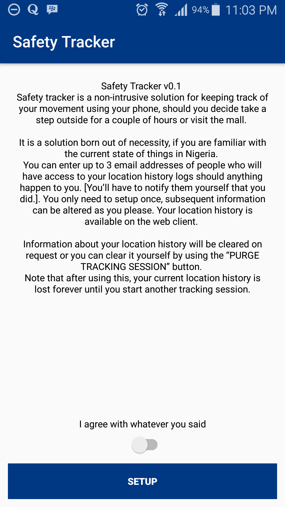
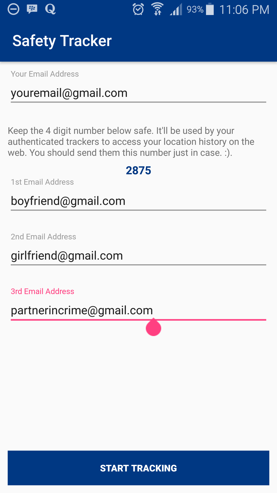
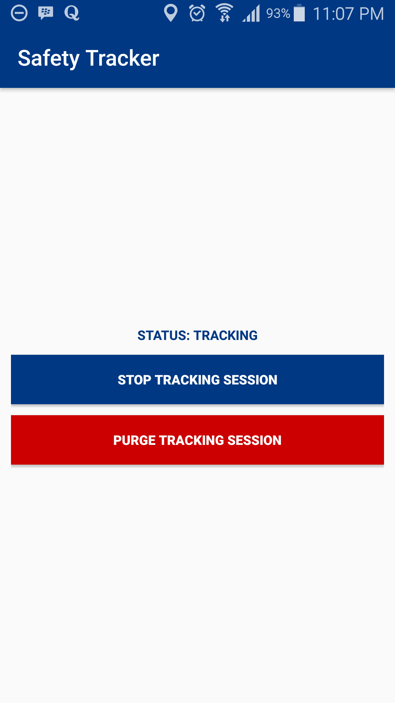

# Safety Tracker for Android
## Safety Tracker for Android. 
### iOS Alternative @ [Safety-Tracker-iOS](https://github.com/helios66/safety-tracker-ios)

**READ THIS!!!!**

Safety tracker for android is a location tracking software to help keep track of your location when you're on the move. 
Your location gets saved and can easily be accessed by those you want to have access on : [Safety Tracker Web](http://safety-tracker.elta.com.ng/) 
using the passkey generated when initiating a tracking session.

**Screenshots**

Wanna talk?
-------

Akapo Damilola (helios66) - <fdamilola@gmail.com>

Contributions
-------

Interested in maintaining or want to use some components? Contact me 👆🏾

## License
